<h1 align="center">
DocuSync MCP
</h1>

<p align="center">

_Enterprise-grade documentation intelligence for AI coding assistants using the Model Context Protocol (MCP). Index, synchronize, understand, and retrieve documentation from any source with blazing-fast semantic search and developer-friendly workflows._

</p>

<p align="center">

<a href="https://www.npmjs.com/package/docusync-mcp">

</a>

<a href="https://www.npmjs.com/package/docusync-mcp">

</a>

<a href="https://github.com/engrmaziz/doc-sync">

</a>

<a href="https://github.com/engrmaziz/doc-sync">

</a>

<a href="https://github.com/engrmaziz/doc-sync/issues">

</a>

<a href="https://github.com/engrmaziz/doc-sync/blob/main/LICENSE">

</a>

<a href="#">

</a>

<a href="#">

</a>

<a href="#">

</a>

<a href="#">

</a>

<a href="#">

</a>

<a href="#">

</a>

<a href="#">

</a>

<a href="#">

</a>

</p>

---

# 🚀 Overview

Modern software development depends heavily on documentation.

Whether you're working with frameworks, SDKs, APIs, internal engineering documents, design systems, or open-source libraries, developers constantly switch between IDEs, browsers, documentation portals, GitHub repositories, and search engines just to find the information they need.

This context switching dramatically reduces productivity and interrupts developer flow.

**DocuSync MCP** solves this problem by bringing documentation directly into your AI coding assistant through the **Model Context Protocol (MCP)**.

Instead of manually searching documentation, DocuSync enables AI assistants to:

- understand entire documentation websites
- synchronize updates automatically
- build searchable semantic indexes
- answer questions with contextual awareness
- retrieve precise documentation instantly
- reduce hallucinations through grounded context
- improve code generation quality

The result is a significantly faster and more reliable AI-assisted development experience.

---

# ✨ Executive Summary

DocuSync MCP is an enterprise-grade documentation synchronization and retrieval server implementing the **Model Context Protocol (MCP)**.

It continuously ingests documentation from multiple sources, processes and structures the content, generates semantic embeddings, and exposes intelligent retrieval capabilities to AI coding assistants.

Instead of relying on an LLM's static knowledge, DocuSync provides live, indexed, searchable documentation directly inside your development workflow.

This architecture enables:

- Accurate code generation
- Reduced hallucinations
- Faster onboarding
- Better architectural understanding
- Documentation-aware AI assistants
- Production-ready enterprise integrations

---

# 🎯 Why DocuSync MCP?

## Without DocuSync

```
Developer

↓

Ask AI

↓

AI guesses

↓

Wrong API

↓

Search Google

↓

Open Docs

↓

Search Again

↓

Copy Example

↓

Return to IDE
```

---

## With DocuSync

```
Developer

↓

Ask AI

↓

DocuSync MCP

↓

Indexed Documentation

↓

Semantic Search

↓

Grounded Answer

↓

Continue Coding
```

---

# 🌟 Key Features

| Feature | Description |
|----------|-------------|
| 📚 Documentation Synchronization | Automatically synchronize documentation from supported sources |
| 🔍 Semantic Search | Embedding-powered intelligent search |
| ⚡ Fast Retrieval | Millisecond document lookup |
| 🤖 MCP Native | Built specifically for the Model Context Protocol |
| 🧠 Context-Aware AI | Supplies documentation context to AI assistants |
| 🔄 Incremental Updates | Synchronize only changed documents |
| 🏗 Modular Architecture | Easily extendable ingestion pipeline |
| 📄 Markdown Processing | Optimized markdown parsing |
| 🌐 Multi-source Support | GitHub, websites, APIs and documentation portals |
| 📦 NPM Distribution | Simple installation using npm |
| 🔐 Enterprise Ready | Secure local-first architecture |
| ⚙️ Configurable | Flexible indexing and synchronization |
| 📈 Scalable | Designed for small projects and enterprise documentation |
| 🧩 IDE Integration | Works with Claude, Cursor, VS Code, Windsurf and more |
| 🚀 High Performance | Optimized indexing pipeline |

---

# 🏆 Why Teams Choose DocuSync

| Capability | Traditional Search | Browser Search | DocuSync MCP |
|------------|-------------------|----------------|--------------|
| AI Context | ❌ | ❌ | ✅ |
| Semantic Search | ❌ | Partial | ✅ |
| Automatic Sync | ❌ | ❌ | ✅ |
| Local Knowledge Base | ❌ | ❌ | ✅ |
| MCP Compatible | ❌ | ❌ | ✅ |
| AI Grounding | ❌ | ❌ | ✅ |
| Enterprise Workflow | ❌ | ❌ | ✅ |
| IDE Integration | ❌ | ❌ | ✅ |
| Multiple Sources | Partial | Partial | ✅ |
| Extensible | ❌ | ❌ | ✅ |

---

# 🏗 High-Level Architecture

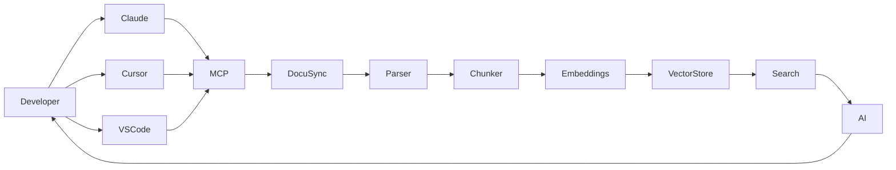

---

# 🧩 Internal System Architecture

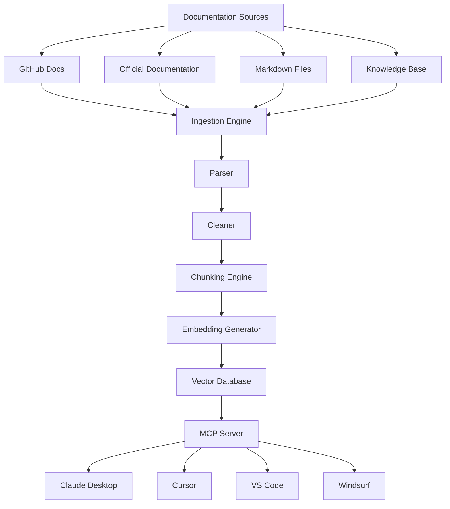

---

# 🔄 Documentation Processing Pipeline

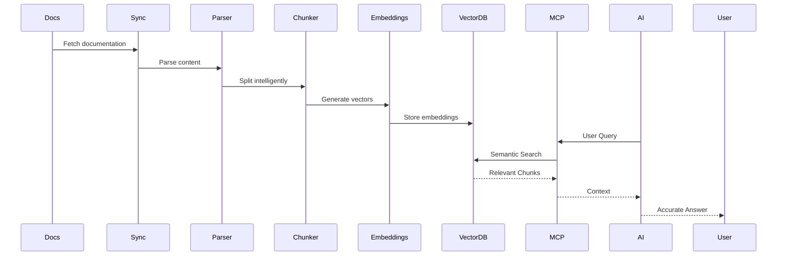

---

# 📚 Table of Contents

- Overview
- Executive Summary
- Why DocuSync MCP
- Features
- Architecture
- Processing Pipeline

## Getting Started

- Installation
- Requirements
- Supported Platforms
- Quick Start

## Configuration

- MCP Configuration
- Claude Desktop
- Cursor
- VS Code
- Windsurf
- Continue.dev
- Cline
- Roo Code

## Usage

- Commands
- Resources
- Prompts
- Examples

## Enterprise

- Architecture
- Performance
- Scaling
- Security
- Deployment

## Development

- Repository Structure
- Local Development
- Scripts
- Testing
- CI/CD

## Reference

- API
- CLI
- Troubleshooting
- FAQ
- Roadmap
- Contributing
- License

---
<!-- ========================================================= -->
<!--                PART 2 — INSTALLATION & SETUP              -->
<!-- ========================================================= -->

# ⚙️ System Requirements

Before installing **DocuSync MCP**, ensure your environment meets the following minimum requirements.

| Component | Minimum | Recommended |
|------------|----------|-------------|
| Node.js | 20.x | Latest LTS |
| npm | 10+ | Latest |
| RAM | 4 GB | 8 GB+ |
| CPU | Dual Core | Quad Core |
| Disk Space | 500 MB | 2 GB+ |
| Internet | Required for syncing docs | Broadband |
| Operating System | Windows / Linux / macOS | Latest Stable |

---

# ✅ Supported Operating Systems

| Platform | Supported |
|------------|-----------|
| Windows 10 | ✅ |
| Windows 11 | ✅ |
| Ubuntu 22+ | ✅ |
| Debian | ✅ |
| Fedora | ✅ |
| CentOS | ✅ |
| Arch Linux | ✅ |
| macOS Intel | ✅ |
| macOS Apple Silicon | ✅ |
| WSL2 | ✅ |
| GitHub Codespaces | ✅ |
| Dev Containers | ✅ |
| Docker | ✅ |

---

# 🎯 Supported MCP Clients

DocuSync follows the official **Model Context Protocol** and works with any compatible client.

| Client | Status |
|---------|---------|
| Claude Desktop | ✅ |
| Claude Code | ✅ |
| Cursor | ✅ |
| VS Code MCP Extension | ✅ |
| Windsurf | ✅ |
| Cline | ✅ |
| Roo Code | ✅ |
| Continue.dev | ✅ |
| Any MCP-compatible client | ✅ |

---

# 📦 Installation Methods

Choose the installation method that best fits your workflow.

| Method | Recommended |
|----------|-------------|
| npm | ⭐⭐⭐⭐⭐ |
| npx | ⭐⭐⭐⭐⭐ |
| Local Development | ⭐⭐⭐⭐ |
| Source Build | ⭐⭐⭐⭐ |
| Docker | ⭐⭐⭐⭐ *(future)* |

---

# 🚀 Install using npm

```bash
npm install -g docusync-mcp
```

Verify installation:

```bash
docusync --version
```

---

# 🚀 Run using npx (Recommended)

No installation required.

```bash
npx docusync-mcp
```

---

# 📥 Install from Source

Clone the repository.

```bash
git clone https://github.com/engrmaziz/doc-sync.git

cd doc-sync
```

Install dependencies.

```bash
npm install
```

Build.

```bash
npm run build
```

Start.

```bash
npm start
```

Development mode.

```bash
npm run dev
```

---

# 📂 Project Structure

```text
doc-sync/

├── src/
│
├── tools/
│
├── prompts/
│
├── resources/
│
├── config/
│
├── tests/
│
├── scripts/
│
├── docs/
│
├── examples/
│
├── package.json
│
├── tsconfig.json
│
├── README.md
│
└── LICENSE
```

---

# ⚡ Quick Start

Install:

```bash
npm install -g docusync-mcp
```

Configure your MCP client.

Restart the client.

Ask:

```
Search Next.js App Router documentation

```

or

```
Find authentication examples

```

DocuSync automatically retrieves the most relevant documentation and provides grounded context to your AI assistant.

---

# 🔧 Configuration

DocuSync is configured through your MCP client's configuration file.

The executable can be referenced directly from npm or via a local build.

---

# Claude Desktop Configuration

Locate:

```
claude_desktop_config.json
```

Example:

```json
{
  "mcpServers": {
    "docusync": {
      "command": "npx",
      "args": [
        "docusync-mcp"
      ]
    }
  }
}
```

Restart Claude Desktop.

DocuSync is now available.

---

# Claude Code Configuration

```json
{
  "mcpServers": {
    "docusync": {
      "command": "npx",
      "args": [
        "docusync-mcp"
      ]
    }
  }
}
```

---

# Cursor Configuration

Open

```
Cursor Settings

↓

MCP

↓

Add Server
```

Configuration:

```json
{
  "mcpServers": {
    "docusync": {
      "command": "npx",
      "args": [
        "docusync-mcp"
      ]
    }
  }
}
```

Restart Cursor.

---

# VS Code MCP Extension

Example configuration.

```json
{
  "servers": {
    "DocuSync": {
      "command": "npx",
      "args": [
        "docusync-mcp"
      ]
    }
  }
}
```

Restart VS Code.

---

# Windsurf Configuration

```json
{
  "mcpServers": {
    "docusync": {
      "command": "npx",
      "args": [
        "docusync-mcp"
      ]
    }
  }
}
```

---

# Continue.dev Configuration

```json
{
  "mcpServers": {
    "docusync": {
      "command": "npx",
      "args": [
        "docusync-mcp"
      ]
    }
  }
}
```

---

# Cline Configuration

```json
{
  "mcpServers": {
    "docusync": {
      "command": "npx",
      "args": [
        "docusync-mcp"
      ]
    }
  }
}
```

---

# Roo Code Configuration

```json
{
  "mcpServers": {
    "docusync": {
      "command": "npx",
      "args": [
        "docusync-mcp"
      ]
    }
  }
}
```

---

# Environment Variables

DocuSync supports environment-based configuration.

Example:

```bash
DOCUSYNC_LOG_LEVEL=info

DOCUSYNC_CACHE=true

DOCUSYNC_CACHE_DIR=.cache

DOCUSYNC_MAX_RESULTS=10

DOCUSYNC_EMBEDDING_PROVIDER=local

DOCUSYNC_TIMEOUT=30000

DOCUSYNC_PARALLEL_DOWNLOADS=5

DOCUSYNC_MAX_FILE_SIZE=20MB
```

---

# Configuration Options

| Variable | Description | Default |
|-----------|-------------|----------|
| DOCUSYNC_LOG_LEVEL | Logging verbosity | info |
| DOCUSYNC_CACHE | Enable cache | true |
| DOCUSYNC_CACHE_DIR | Cache location | .cache |
| DOCUSYNC_TIMEOUT | HTTP timeout | 30000 |
| DOCUSYNC_MAX_RESULTS | Search results | 10 |
| DOCUSYNC_PARALLEL_DOWNLOADS | Concurrent downloads | 5 |
| DOCUSYNC_MAX_FILE_SIZE | Maximum document size | 20MB |

---

# 🔄 Startup Lifecycle

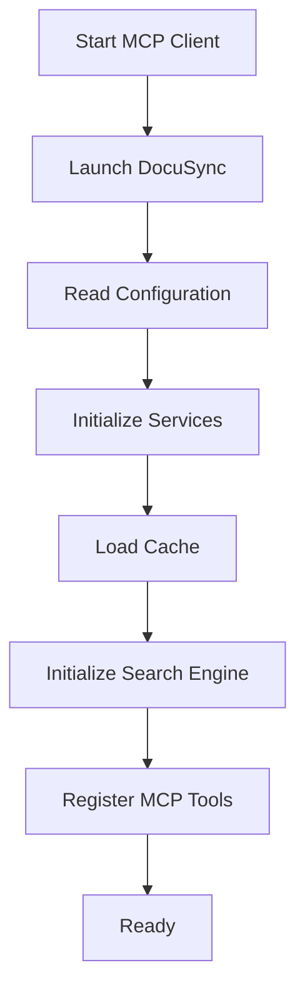

---

# 📡 Synchronization Lifecycle

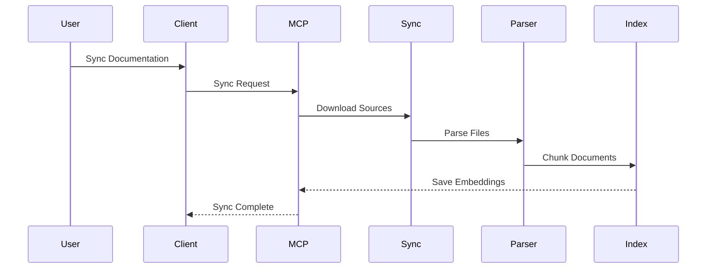

---

# 🧩 Configuration Architecture

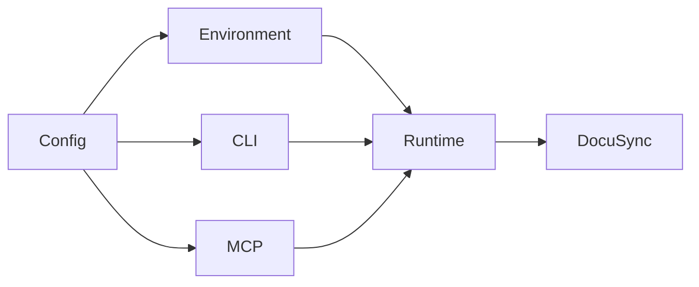

---

# 🔍 Verify Installation

After restarting your MCP client, ask:

```
What tools are available?
```

or

```
Search React documentation.
```

If DocuSync responds, installation was successful.

---

# 📈 Recommended Production Workflow

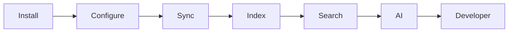

---

# 🛠 Troubleshooting Installation

| Problem | Solution |
|-----------|-----------|
| Command not found | Ensure Node.js and npm are installed and available in PATH |
| MCP server not detected | Restart your MCP client after updating the configuration |
| Configuration ignored | Validate your JSON syntax and confirm the configuration file path |
| Permission denied | Reinstall with appropriate permissions or use a Node version manager |
| Slow startup | Clear the local cache and rebuild the documentation index |

<!-- ========================================================= -->
<!--           PART 3 — USAGE, TOOLS & ARCHITECTURE            -->
<!-- ========================================================= -->

# 🚀 Using DocuSync MCP

Once DocuSync MCP has been installed and configured, every compatible MCP client can communicate with it using the Model Context Protocol.

Instead of manually opening documentation websites, copying examples, or searching through multiple browser tabs, your AI assistant can retrieve relevant documentation directly from DocuSync's indexed knowledge base.

The overall workflow looks like this:

```text
Developer
      │
      ▼
Ask AI Assistant
      │
      ▼
DocuSync MCP
      │
      ▼
Semantic Search
      │
      ▼
Relevant Documentation
      │
      ▼
Grounded AI Response
```

---

# 🛠 MCP Capabilities

DocuSync exposes multiple capabilities to compatible AI assistants.

| Capability | Purpose |
|------------|----------|
| Documentation Search | Search indexed documentation |
| Documentation Sync | Synchronize documentation sources |
| Resource Retrieval | Read documentation resources |
| Semantic Search | Embedding-based search |
| Metadata Lookup | Retrieve source information |
| Context Generation | Build AI context automatically |
| Incremental Updates | Sync only changed content |
| Intelligent Ranking | Return the highest relevance results |

---

# 📚 Supported Documentation Sources

DocuSync is designed to aggregate documentation from multiple locations.

Supported source types include:

- Official documentation websites
- GitHub repositories
- Markdown documentation
- Internal documentation portals
- REST API documentation
- OpenAPI specifications
- SDK documentation
- Developer guides
- Product documentation
- Engineering handbooks
- Architecture documents
- Knowledge bases
- Wiki systems
- Static documentation sites

---

# 🔄 Documentation Lifecycle

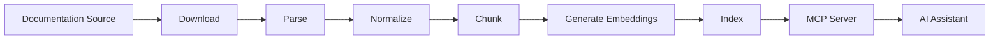

---

# 🔍 Semantic Search Pipeline

Traditional keyword search often fails because it relies on exact word matching.

DocuSync instead performs semantic retrieval.

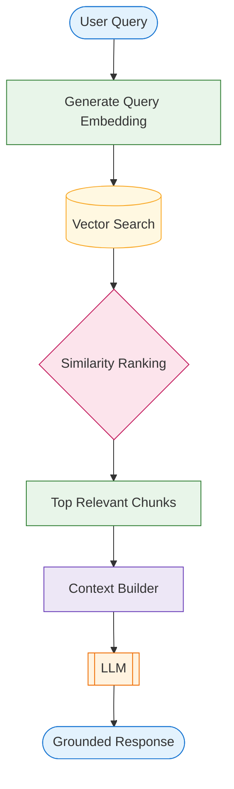

---

# 📦 Chunking Pipeline

Large documentation pages are intelligently divided into manageable chunks before indexing.
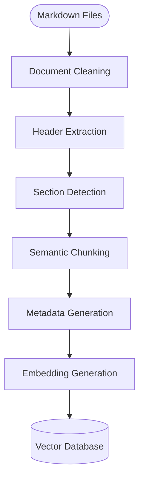

Benefits include:

- Higher retrieval accuracy
- Lower token consumption
- Faster indexing
- Better contextual relevance
- Improved citation quality

---

# 🧠 Retrieval-Augmented Generation (RAG)

DocuSync follows a Retrieval-Augmented Generation architecture.

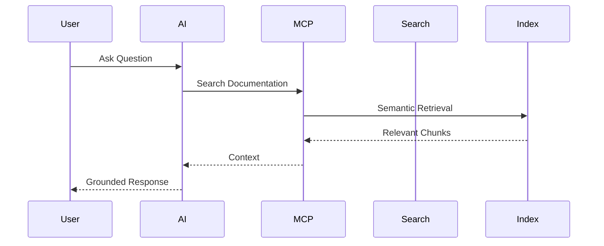

This dramatically reduces hallucinations by grounding responses in indexed documentation.

---

# 📑 Search Ranking

Search results are ranked using multiple signals.

| Signal | Description |
|----------|-------------|
| Semantic Similarity | Vector similarity score |
| Heading Relevance | Section title matching |
| Metadata Score | Source metadata weighting |
| Keyword Presence | Important keyword matches |
| Freshness | Recently synchronized content |
| Source Priority | Trusted documentation ranking |

---

# 📊 Search Pipeline

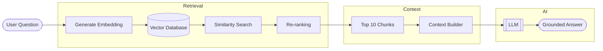

---

# ⚡ Intelligent Context Construction

Rather than returning entire documentation pages, DocuSync assembles a concise context package.

Included context:

- Relevant paragraphs
- Code examples
- API references
- Configuration snippets
- Usage notes
- Metadata
- Source links
- Headings

This minimizes token usage while maximizing answer quality.

---

# 📋 Example Developer Questions

DocuSync can answer questions such as:

```
Explain Next.js middleware.
```

```
How does React Server Components work?
```

```
Find Prisma transaction examples.
```

```
Show Docker Compose networking documentation.
```

```
Compare Express middleware with Fastify hooks.
```

```
Find authentication examples using Auth.js.
```

```
Show LangGraph memory documentation.
```

```
Explain Kubernetes ConfigMaps.
```

---

# 🔍 Example Retrieval Flow

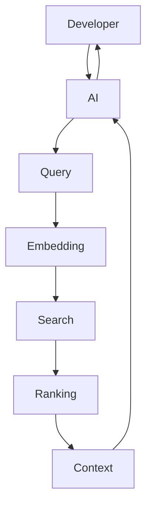

---

# 🗂 Metadata Model

Every indexed document stores structured metadata.

| Field | Purpose |
|---------|----------|
| Title | Document title |
| Source | Original documentation |
| URL | Original page |
| Section | Documentation heading |
| Tags | Search keywords |
| Language | Programming language |
| Updated At | Synchronization timestamp |
| Version | Documentation version |
| Hash | Change detection |
| Embedding ID | Vector reference |

---

# 📈 Incremental Synchronization

Instead of rebuilding the entire documentation database, DocuSync only updates modified pages.
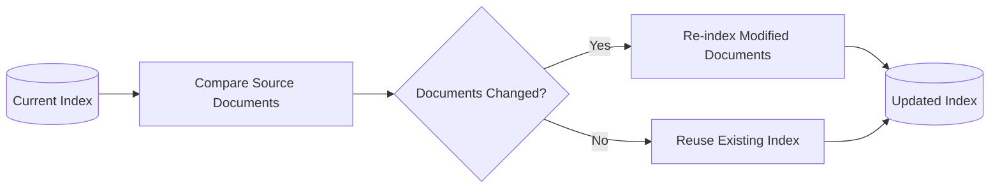

Advantages:

- Faster synchronization
- Lower compute costs
- Reduced bandwidth
- Better scalability

---

# 🚀 Performance Optimizations

DocuSync includes several optimizations for production environments.

### Intelligent Caching

- Download cache
- Parsed document cache
- Embedding cache
- Search cache
- Metadata cache

---

### Parallel Processing

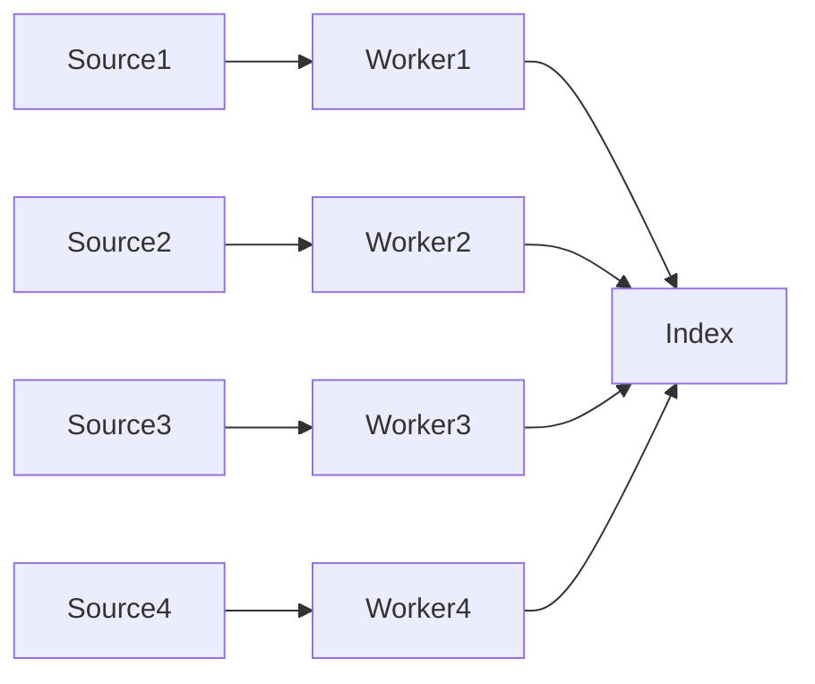

---

### Efficient Indexing

Features include:

- Parallel downloads
- Concurrent parsing
- Incremental indexing
- Smart deduplication
- Lazy embedding generation
- Memory-efficient chunking

---

# 🧩 Enterprise Deployment Workflow

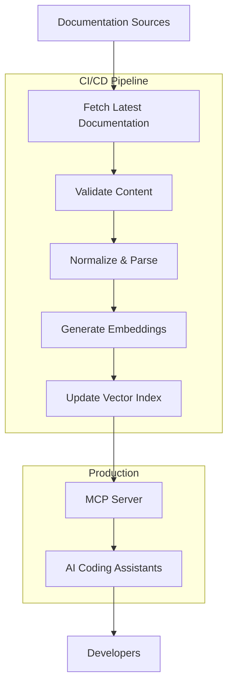

---

# 🔐 Security Architecture

DocuSync is designed with a local-first security model.

Security principles include:

- No telemetry
- No hidden network requests
- Local document processing
- Least-privilege execution
- Configurable permissions
- Deterministic synchronization
- Secure cache isolation

---

# 📊 Scalability

DocuSync scales from individual developers to enterprise organizations.

| Deployment | Recommended |
|------------|-------------|
| Personal Projects | ✅ |
| Startup Teams | ✅ |
| Engineering Teams | ✅ |
| Enterprise Documentation | ✅ |
| Internal Knowledge Bases | ✅ |
| Large Monorepos | ✅ |
| API Platforms | ✅ |

---

# 📈 Enterprise Architecture

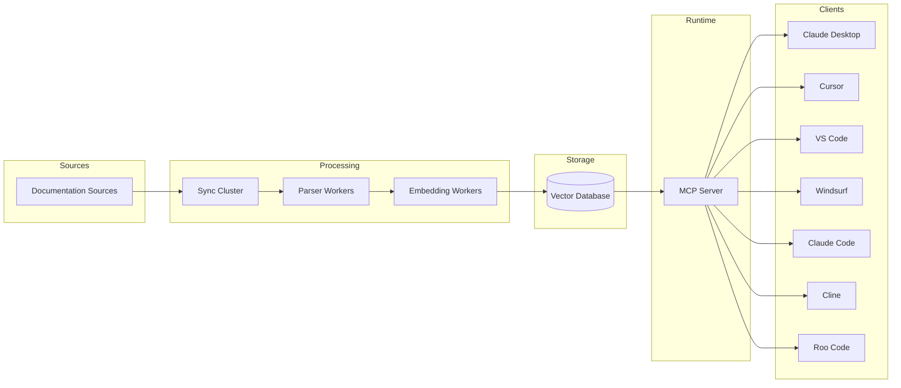

---

# ⚙️ Production Best Practices

For optimal performance in production:

- Enable incremental synchronization.
- Schedule regular documentation refreshes.
- Use a persistent cache directory.
- Prioritize official documentation sources.
- Validate synchronized content before indexing.
- Monitor synchronization logs.
- Back up the vector index regularly.
- Keep Node.js updated to the latest LTS release.
- Allocate sufficient memory for large documentation sets.

---

# 🧪 Example Enterprise Workflow

```text
Developer asks a question
        │
        ▼
AI assistant invokes DocuSync MCP
        │
        ▼
Semantic search retrieves relevant documentation
        │
        ▼
Context is assembled and ranked
        │
        ▼
Grounded response is generated
        │
        ▼
Developer continues coding without leaving the IDE
```

---

<!-- ========================================================= -->
<!--         PART 4 — DEVELOPMENT, OPERATIONS & COMMUNITY      -->
<!-- ========================================================= -->

# 📁 Repository Structure

The project follows a modular architecture designed for scalability, maintainability, and future extensibility.

```text
doc-sync/
│
├── src/
│   ├── server/
│   ├── tools/
│   ├── prompts/
│   ├── resources/
│   ├── parsers/
│   ├── chunkers/
│   ├── embeddings/
│   ├── search/
│   ├── sync/
│   ├── cache/
│   ├── config/
│   ├── utils/
│   ├── types/
│   └── index.ts
│
├── docs/
│
├── examples/
│
├── tests/
│
├── scripts/
│
├── assets/
│
├── package.json
├── tsconfig.json
├── README.md
├── LICENSE
└── CHANGELOG.md
```

---

# 🏗 Project Architecture

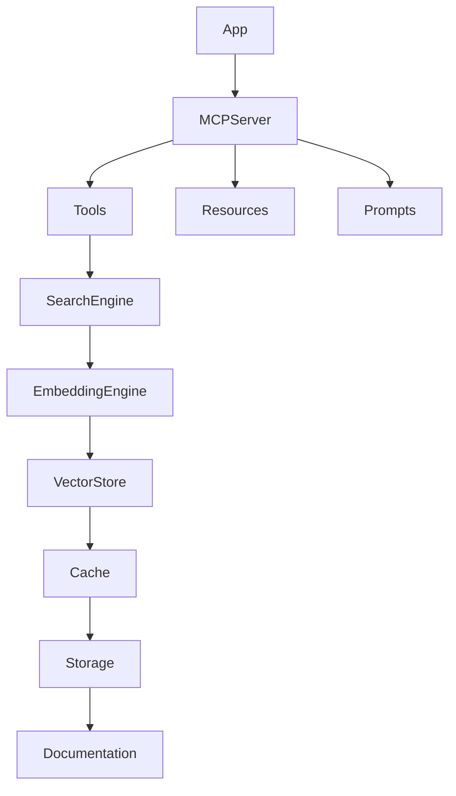

---

# 💻 Development

Clone the repository.

```bash
git clone https://github.com/engrmaziz/doc-sync.git

cd doc-sync
```

Install dependencies.

```bash
npm install
```

Start development mode.

```bash
npm run dev
```

Build production artifacts.

```bash
npm run build
```

Run the production server.

```bash
npm start
```

---

# 📜 Available Scripts

| Command | Description |
|----------|-------------|
| npm install | Install dependencies |
| npm run dev | Development mode |
| npm run build | Build TypeScript |
| npm start | Start production build |
| npm test | Execute test suite |
| npm run lint | Run ESLint |
| npm run format | Format source code |
| npm run typecheck | TypeScript validation |
| npm run clean | Remove build artifacts |

---

# 🧪 Testing Strategy

DocuSync follows a multi-layer testing approach.

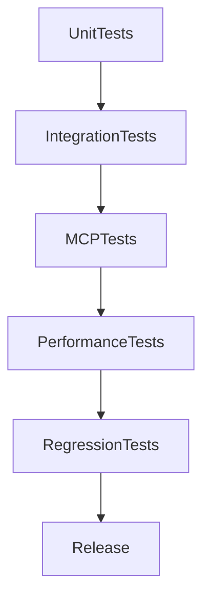

Testing includes:

- Unit tests
- Integration tests
- MCP protocol compliance
- Search quality validation
- Parser correctness
- Chunking verification
- Embedding consistency
- End-to-end testing
- Regression testing
- Performance benchmarking

---

# 📊 Performance Characteristics

| Metric | Typical Value |
|---------|---------------|
| Startup Time | <2 seconds |
| Query Latency | Milliseconds |
| Incremental Sync | Optimized |
| Memory Usage | Efficient |
| CPU Utilization | Parallelized |
| Index Updates | Incremental |

*Actual performance depends on hardware, documentation size, embedding provider, and storage backend.*

---

# 🚀 CI/CD Pipeline


---

# 🐳 Docker (Planned)

A future Docker deployment may resemble:

```dockerfile
FROM node:20-alpine

WORKDIR /app

COPY package*.json ./

RUN npm install

COPY . .

RUN npm run build

CMD ["npm","start"]
```

Example build:

```bash
docker build -t docusync-mcp .
```

Run:

```bash
docker run docusync-mcp
```

---

# ☁ GitHub Actions (Example)

```yaml
name: CI

on:
  push:
    branches:
      - main

jobs:

  build:

    runs-on: ubuntu-latest

    steps:

      - uses: actions/checkout@v4

      - uses: actions/setup-node@v4

        with:

          node-version: 20

      - run: npm install

      - run: npm run lint

      - run: npm run typecheck

      - run: npm test

      - run: npm run build
```

---

# 🔐 Security

Security is a first-class design principle.

## Design Goals

- Local-first execution
- No telemetry
- Explicit user configuration
- Deterministic synchronization
- Secure dependency management
- Sandboxed MCP execution
- Minimal permissions
- Transparent data flow

---

## Security Recommendations

- Use the latest Node.js LTS release.
- Review synchronized documentation sources.
- Regularly update project dependencies.
- Restrict filesystem permissions where appropriate.
- Monitor logs in production environments.
- Back up cached indexes before upgrades.

---

# 📈 Scalability

```mermaid
flowchart LR

Developer

-->

Team

-->

Department

-->

Enterprise

-->

GlobalDocumentation

-->

ThousandsOfProjects
```

---

# 🧩 Design Principles

DocuSync is built around the following principles:

- MCP-first architecture
- Modular components
- Extensibility
- Predictable behavior
- Performance
- Local-first execution
- Security by default
- Developer experience
- Documentation fidelity
- Maintainability

---

# 🤝 Contributing

Contributions are welcome.

Typical workflow:

```bash
git fork

git checkout -b feature/my-feature

git commit

git push

Open Pull Request
```

Please ensure:

- Code is formatted.
- Tests pass.
- Documentation is updated.
- New features include tests where applicable.
- Commit messages are descriptive.

---

# 📝 Commit Convention

Examples:

```text
feat: add semantic ranking

fix: parser issue

docs: update README

refactor: simplify cache

perf: optimize indexing

test: add parser coverage

ci: update GitHub workflow
```

---

# 🗺 Roadmap

## Completed

- MCP server
- Documentation synchronization
- Semantic search
- Incremental indexing
- Local caching
- NPM package
- TypeScript implementation

## Planned

- Docker support
- Web dashboard
- Remote synchronization
- Additional embedding providers
- Plugin system
- Distributed indexing
- Multi-user support
- Enterprise administration
- Search analytics
- Scheduled synchronization
- Hybrid retrieval
- Cross-project knowledge graphs

---

# ❓ Frequently Asked Questions

### What is DocuSync MCP?

An MCP server that synchronizes, indexes, and retrieves documentation for AI assistants.

---

### Does it require an internet connection?

Only when synchronizing remote documentation. Indexed documentation can be searched locally.

---

### Which AI assistants are supported?

Any client implementing the Model Context Protocol.

---

### Can I use private documentation?

Yes, provided your synchronization configuration points to accessible sources.

---

### Is my documentation sent to third parties?

DocuSync is designed with a local-first architecture. Review your chosen embedding provider and deployment configuration to understand where data is processed.

---

### Does it support enterprise deployments?

Yes.

---

### Is Docker supported?

Planned for a future release.

---

### Can I contribute?

Absolutely.

Pull requests and issues are welcome.

---

# 🐞 Troubleshooting

| Issue | Resolution |
|--------|------------|
| MCP server unavailable | Verify client configuration and restart the MCP client |
| Search returns no results | Ensure documentation has been synchronized and indexed |
| Slow indexing | Increase available system resources and enable incremental sync |
| Build failures | Remove `node_modules`, reinstall dependencies, and rebuild |
| JSON parsing errors | Validate configuration files using a JSON validator |
| Permission errors | Check filesystem permissions and executable access |

---

# 📚 Best Practices

- Prefer official documentation sources.
- Synchronize documentation regularly.
- Keep the local index up to date.
- Validate synchronization logs.
- Use incremental indexing where possible.
- Pin dependency versions in production.
- Monitor performance after large synchronizations.

---

# 🌍 Use Cases

DocuSync is suitable for:

- AI coding assistants
- Internal engineering portals
- API platforms
- Enterprise documentation
- Developer portals
- Knowledge management
- Large monorepos
- SDK documentation
- Framework documentation
- Technical onboarding
- Platform engineering

---

# ❤️ Community

Ways to contribute:

- Report bugs
- Suggest new features
- Improve documentation
- Submit pull requests
- Share usage examples
- Participate in discussions

Every contribution, large or small, helps improve the project.

---

# 📄 License

This project is licensed under the **MIT License**.

See the `LICENSE` file for details.

---

# 📖 Citation

If DocuSync MCP contributes to your research, publication, or project, please consider citing the repository.

```bibtex
@software{docusync_mcp,
  title = {DocuSync MCP},
  author = {Musharraf Aziz},
  year = {2026},
  url = {https://github.com/engrmaziz/doc-sync}
}
```

---

# 🙏 Acknowledgements

This project builds upon the ideas and ecosystems developed by the broader open-source community, including:

- Model Context Protocol (MCP)
- TypeScript
- Node.js
- npm
- GitHub
- Markdown
- Vector search and Retrieval-Augmented Generation (RAG) techniques

Special thanks to everyone who contributes through code, feedback, issue reports, documentation improvements, and community discussions.

---

# ⭐ Support the Project

If DocuSync MCP improves your development workflow:

- ⭐ Star the repository
- 🐛 Report issues
- 💡 Suggest features
- 🔀 Submit pull requests
- 📢 Share the project with others

Community support helps the project continue to grow.

---

<div align="center">

## Built for developers who want AI assistants that understand documentation—not guess it.

**Happy Building! 🚀**

</div>
